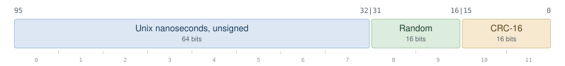

# µID

12 bytes — nanosecond timestamp, random field, CRC-16 — as 16 sortable base62 characters.

Compact, time-ordered, self-validating unique identifiers for Go. The text form is
case-sensitive, and the binary form orders the same way, so a µID works as a primary key that
still gives chronological ordering from a plain index scan. Every code artifact is ASCII: the
module path `github.com/vshuraeff/muid`, the package `muid`, and the `muid` binary.

Throughout, "creation order" means creation order within one generator, where it is exact;
the package-level `New` is a single generator per process. Ids from different generators sort
by their embedded timestamps, so their relative order is only as good as the agreement
between those clocks, and ids created in the same nanosecond sort by a random field that
carries no temporal meaning.

```
9yrSO26OoIfbvR9t
9yrSO26Qa43u4ogZ
9yrSO26QnToYjAL8
```

> [!NOTE]
> Those ids, and every other example in this file, are real ids generated when the file was
> written, so they decode to that date rather than to today's.

The timestamp is an unsigned 64-bit Unix nanosecond count, the random field is 16 bits, and
the checksum is a 16-bit CRC-16/CCITT-FALSE over the other ten bytes. The checksum is what
makes a µID self-validating: `Parse` rejects a corrupted or mistyped id instead of handing
back a plausible-looking wrong one.

Compared with a UUIDv7 it is under half the string length (16 characters against 36),
timestamps to the nanosecond rather than the millisecond, is strictly monotonic within the
generator that produced it, and carries an integrity check.

## Install

```sh
go get github.com/vshuraeff/muid
```

### Development

The `Makefile` drives the standard Go toolchain and needs no external linters. `make all`
runs lint, tests, and build; `make test` runs the race-enabled suite; `make fuzz` runs the
parse fuzz target; `make bench` runs the benchmarks; `make lint` checks formatting and runs
`go vet`; `make install` puts the `muid` binary into `~/.local/bin`. `make help` lists every
target.

> [!TIP]
> Under Go 1.26.6, `make fuzz` intermittently ends with `context deadline exceeded` without
> having found anything: that is the fuzz coordinator missing its own deadline. A real
> failure prints the failing input and writes a minimized seed under `testdata/fuzz/`, so
> that message with no new file there is the flake, and rerunning is the response. Any other
> failure, or one that does leave a seed behind, is a real result.

## Usage

### Generate

```go
id := muid.New()          // muid.Muid
s := muid.NewString()     // "9yrSO26OoIfbvR9t"

fmt.Println(id)           // String() is the canonical 16-character form
fmt.Println(id.Time())    // the encoded timestamp, nanosecond precision
fmt.Println(id.IsZero())  // false
```

### Generate with a node id

`New` draws the 16-bit random field, which is what makes uniqueness across processes
probabilistic. Where the nodes that generate ids can be numbered by whoever deploys them,
`NewNodeGenerator` puts that number in the field instead of a random draw, and ids from
differently numbered nodes then cannot collide at all:

```go
gen := muid.NewNodeGenerator(node) // node is a uint16 the operator assigns

id := gen.New()      // muid.Muid, carrying node in bytes 8..9
s := gen.NewString() // a further id from the same generator, as canonical text
```

Every id from `gen` carries `node` where a random field would be, so the generator has
nothing left to separate ids created in one nanosecond: it advances the timestamp by one
nanosecond per id instead of walking a range of 65536 random values. It stays strictly
monotonic and unique within itself, and above $`10^9`$ ids per second its timestamps run
ahead of the clock until the clock catches up.

Two live generators must never share a node id. They would not merely risk a collision: any
two of their ids that carry the same timestamp are byte-identical. Across a restart of one
node, uniqueness holds only if the first id after the restart carries a timestamp strictly
greater than the largest one that node emitted before it — an equal timestamp reproduces an
id the previous incarnation already emitted.

> [!WARNING]
> Do not derive the node id by hashing a hostname, a pod name, or a pid. Hashing does not
> reduce the expected number of collisions; it converts an occasional collision into a
> permanent one, because two nodes whose names hash to the same 16-bit value duplicate each
> other's ids on every shared timestamp for as long as both run. With 100 nodes, the chance
> that some pair shares a hash is 7.3%. A node id has to come from a source that is unique by
> construction: a StatefulSet ordinal, a per-instance config value, or a central assignment.
> That is why this package ships no hashing helper.

The node id is not a secret: every id a node emits carries it in the clear, so anyone holding
a few ids can tell which of them came from the same node.

### Parse

```go
id, err := muid.Parse("9yrSO26OoIfbvR9t")
if errors.Is(err, muid.ErrInvalid) {
    // wrong length, character outside the alphabet, or bad checksum
}

id = muid.MustParse("9yrSO26OoIfbvR9t") // panics instead of returning an error
```

`Parse` is strict. The input must be exactly 16 characters from the base62 alphabet, and it
is case-sensitive: there are no aliases, no case folding, and no substitutions, so
`Parse(s).String() == s` for every accepted `s`.

### Sort and compare

```go
slices.SortFunc(ids, muid.Muid.Compare)

if a.Compare(b) < 0 {
    // a has the lower id: an earlier timestamp, or the same nanosecond and a lower random field
}
```

Since the text form is fixed-width base62 over an alphabet that is already in ASCII order,
byte-wise string comparison gives the same order as `Compare`. In a database, a text index
reproduces that same order under a binary or code-point collation — PostgreSQL `C`, or
`COLLATE "C"` on the column, and a MySQL `*_bin` collation.

> [!WARNING]
> Under any other collation the index order is whatever that collation defines, so either pin
> the collation or store the raw 12 bytes.

### Appending to a byte buffer

```go
buf := make([]byte, 0, 32)
buf = append(buf, "id="...)
buf, _ = id.AppendText(buf) // appends the 16 characters, error is always nil
```

`AppendText` allocates nothing as long as `buf` has 16 bytes of spare capacity; otherwise the
underlying `append` grows it as usual.

### JSON and other text encodings

`Muid` implements `encoding.TextMarshaler` and `*Muid` implements
`encoding.TextUnmarshaler`, so `encoding/json` encodes a µID as a JSON string and accepts
it as a JSON map key. Other text formats — YAML, URL query binding, config decoders — work
the same way in libraries that honor those two interfaces, which most but not all do:

```go
type Event struct {
    ID   muid.Muid `json:"id"`
    Body string    `json:"body"`
}

b, _ := json.Marshal(Event{ID: muid.New(), Body: "hello"})
// {"id":"9yrSO26R5m4kRHGg","body":"hello"}

var e Event
_ = json.Unmarshal(b, &e)
```

Unmarshalling runs the same checksum verification as `Parse`, so a mangled id in a payload
fails decoding rather than becoming a valid-looking key.

`MarshalBinary` and `UnmarshalBinary` are also available for the raw 12-byte form.

### database/sql

`Value` stores the canonical text; `Scan` accepts either the 16-character text (as `string`
or `[]byte`) or the raw 12 bytes.

> [!IMPORTANT]
> Reads therefore work against a `char(16)`, `text`, or `bytea`/`blob` column alike, but
> writes only against the text-shaped ones: binding a `Muid` straight into a raw byte column
> stores the 16 ASCII characters of the text form, not the 12 bytes, and no error is raised.
> Write the raw form as `id[:]`, or convert in SQL. On PostgreSQL, the `muid` domain rejects
> that mis-sized write instead of storing it — see [POSTGRES.md](POSTGRES.md) for the binding
> rules per driver.

```go
_, err := db.Exec("insert into events (id, body) values (?, ?)", muid.New(), "hello")

var id muid.Muid
err = db.QueryRow("select id from events where body = ?", "hello").Scan(&id)
```

For nullable columns, wrap it in the generic null type from `database/sql`:

```go
var id sql.Null[muid.Muid]
err = db.QueryRow("select parent_id from events where id = ?", child).Scan(&id)
if id.Valid {
    use(id.V)
}
```

## Self-validation

The last two bytes are a CRC-16/CCITT-FALSE checksum over the first ten — polynomial
`0x1021`, initial value `0xffff`, no reflection and no final xor, the variant whose check
value over `"123456789"` is `0x29b1`.

Every entry point that turns outside data into a `Muid` verifies it: `Parse`, `MustParse`,
`UnmarshalText`, `UnmarshalBinary`, and `Scan`. A truncated copy-paste, a flipped character,
a wrong case, or a corrupted blob is rejected with an error wrapping `ErrInvalid` and is
caught with probability $`1 - 2^{-16}`$. `UnmarshalBinary` and `Scan` additionally reject
binary input whose 96-bit value is at or above $`62^{16}`$, since such a value has no
16-character text form.

Two consequences are worth stating plainly:

- The checksum is deterministic — it is a function of the ten preceding bytes, so it adds
  nothing to uniqueness. Only the timestamp and the random field carry entropy.
- Not every 12-byte pattern is a µID. The zero value encodes as sixteen `0` characters, but
  it is not checksum-valid, so parsing that text fails. Round-tripping is guaranteed for ids
  produced by `New` or accepted by `Parse`, `UnmarshalBinary`, or `Scan`, not for arbitrary
  bytes you construct yourself.

## Format

The normative format specification lives in [SPEC.md](SPEC.md). A pure-SQL PostgreSQL
implementation, needing no extension, lives in [postgres/muid.sql](postgres/muid.sql) and is
documented in [POSTGRES.md](POSTGRES.md).

| Property        | Value                                                               |
| --------------- | ------------------------------------------------------------------- |
| Binary size     | 12 bytes, big-endian                                                |
| Valid values    | 96-bit values below $`62^{16}`$ (`0x9a09afbae83050a9de010000`)      |
| Text length     | exactly 16 characters, left-padded with `0`                         |
| Alphabet        | `0123456789ABCDEFGHIJKLMNOPQRSTUVWXYZabcdefghijklmnopqrstuvwxyz`    |
| Case            | significant; no aliases and no normalization                        |
| Time resolution | nanoseconds, through 2321-09-25T13:06:13.925556393Z                 |
| Ordering        | binary, text, and numeric order agree; creation order per generator |

Bit layout, most significant bit first:

<picture>
  <source media="(prefers-color-scheme: dark)" srcset="assets/bit-layout-dark.svg">
  
</picture>

|  Bits   | Width | Content                                                                |
| :-----: | ----: | ---------------------------------------------------------------------- |
| 95 – 32 |    64 | Unix nanoseconds, unsigned; the top bit may be set                     |
| 31 – 16 |    16 | random field: random at the start of each nanosecond, then incremented |
| 15 – 0  |    16 | CRC-16/CCITT-FALSE over the first 10 bytes                             |

A µID is valid when its 96-bit value is below $`62^{16}`$ and its checksum matches. The two
entry paths enforce that bound differently. The text form is the 96-bit value written as a
base62 integer padded to a fixed 16 characters, and every 16-character base62 string is
below $`62^{16}`$ by construction, so `Parse` needs no range check at all: it validates
length, alphabet, and checksum. The binary path has no such guarantee and rejects any
12-byte input whose value is at or above the bound. Because the alphabet is listed in ASCII
order and the width is fixed, lexicographic order over the text equals numeric order over
the value.

<details>
<summary>Range edge cases and compatibility with the earlier format</summary>

The bound puts the highest representable timestamp at 11099595973925556393 nanoseconds,
2321-09-25T13:06:13.925556393Z. That exact maximum is only encodable with a random field of
`0xde00` or below; with a random field of `0xffff` the highest timestamp is one nanosecond
lower. At the other end, `New` clamps a pre-1970 clock reading to timestamp 0, so the
timestamp field is never negative.

`Time()` returns a `time.Time` for any µID, but `UnixNano` on that result is only defined
over its own range, roughly 1678 through 2262. Code that must handle timestamps beyond 2262
should read the first eight binary bytes as a big-endian `uint64` instead.

These rules are a strict widening of the earlier top-bit-zero, $`2^{95}`$-bounded format:
every identifier valid under those rules is still valid and still encodes to the same text.

</details>

## Guarantees

- **Strictly monotonic and unique within one generator**, including across a clock rollback.
  `New` is a single generator shared by the whole process, so for it that scope is the
  process. Generation is serialized: when the clock does not advance past the last value used,
  the random field is incremented instead, and if that field wraps, the timestamp is nudged
  forward by one nanosecond. Two calls on one generator never return the same value and never
  return a value that sorts before an earlier one, whatever the wall clock does.
- **Probabilistic across processes**: roughly a $`2^{-16}`$ chance of collision per pair of
  ids generated in the same nanosecond by different processes, which do not coordinate. Their
  relative ordering also depends on their clocks being in agreement. Numbering the nodes with
  [`NewNodeGenerator`](#generate-with-a-node-id) removes that chance between distinctly
  numbered nodes, at the cost of coordinating the numbers.

That $`2^{-16}`$ is a deliberate trade. Schemes with a large random component buy longer
odds by spending bits; µID spends its bits on a nanosecond timestamp, a 16-character text
form, and a checksum instead. Nanosecond timestamps already make same-nanosecond overlap
rare between processes, and the checksum turns silent corruption into a loud error — which,
in practice, is the failure that actually happens. If your threat model is many
uncoordinated writers generating ids at nanosecond alignment, prefer a scheme with a bigger
random field.

## Non-goals

> [!CAUTION]
> **Not a security token.** Within a single nanosecond, the random field is sequential after
> the first value, so given one id the next ones are guessable, and the checksum is
> computable by anyone. Never use a µID as a session token, password reset key, or
> capability URL — use `crypto/rand` for those.

- **Nanoseconds are the storage unit, not a guaranteed clock resolution.** The value is as
  precise as `time.Now` on the host, which on many platforms is coarser than a nanosecond;
  treat `Time()` as an ordering key with a timestamp attached, not as a measurement.
- **No embedded machine or process identity by default.** `New` has no node id to configure
  and none to leak, which is also why its cross-process uniqueness is probabilistic rather
  than guaranteed. `NewNodeGenerator` is the opt-in exception: the node id it embeds is
  assigned openly and travels in the clear, so ids from one node are linkable by anyone who
  collects them. It is not obscured, and 16 bits are trivially enumerable, so no privacy
  property is claimed for it. Where that linkability is unacceptable, stay on `New`.

## Comparison

The table compares format definitions — sizes, precision, and what each layout does or does
not contain. Measured timings, for µID only, follow it.

| Parameter                        | µID            | UUIDv4           | UUIDv7              | ULID             | xid                     | ksuid               |
| -------------------------------- | :------------: | :--------------: | :-----------------: | :--------------: | :---------------------: | :-----------------: |
| Binary size                      | 12 bytes       | 16 bytes         | 16 bytes            | 16 bytes         | 12 bytes                | 20 bytes            |
| Text length                      | 16             | 36               | 36                  | 26               | 20                      | 27                  |
| Timestamp precision              | nanoseconds    | none             | milliseconds        | milliseconds     | seconds                 | seconds             |
| Text sorts by time               | yes            | no               | yes                 | yes              | yes                     | yes                 |
| In-process monotonic[^monotonic] | per generator  | no               | optional (RFC 9562) | optional (spec)  | counter within a second | optional (Sequence) |
| Checksum                         | CRC-16         | none             | none                | none             | none                    | none                |
| Host/process field               | none           | none             | none                | none             | machine id + pid        | none                |
| Case handling                    | case-sensitive | case-insensitive | case-insensitive    | case-insensitive | case-sensitive          | case-sensitive      |
| Upper time bound                 | 2321           | n/a              | 10889               | 10889            | 2106                    | 2150                |

Where the six do not differ: all are fixed-width, and all encode to characters that need no
escaping in a URL, a filename, or a shell word. None of them needs a central allocator or a
registry.

<details>
<summary>Reading the differences</summary>

- 16 characters is the shortest text form of the six, and 12 bytes ties xid for the smallest
  binary form. µID and xid occupy the same 96 physical bits; µID prints them in four fewer
  characters because base62 packs more per character than base32, which works only because
  the format restricts values to below $`62^{16}`$ — 16 base62 digits span about 95.3 bits.
  It spends 16 of those bits on the checksum that the others do not have.
- Only µID timestamps to the nanosecond. The millisecond and second formats put far more
  ids into one indistinguishable time bucket, where their ordering falls back to a counter or
  to random bits.
- µID's monotonicity is not an option: `New` is serialized, so it is strictly increasing
  within one process even across a clock rollback (see [Guarantees](#guarantees)). UUIDv7
  (RFC 9562 counter methods), ULID (the spec's monotonic mode) and ksuid (the reference
  package's `Sequence`, sorted until its 65536-value sequence is exhausted) all offer
  monotonic generation as an opt-in a given library may or may not implement.
- The CRC-16 is the only integrity check in the table. None of the other formats carries a
  general typo-detecting checksum: a few mutations are caught incidentally — a character
  outside the alphabet anywhere, a ULID whose leading character overflows 128 bits, a bad
  UUID version or variant nibble in a strict parser — but most single-character mutations
  decode as a different, equally valid id. With µID they yield an error.
- Embedding no host or process identity by default means there is nothing to configure and
  nothing to leak; the price is that cross-process uniqueness is probabilistic, which the
  [Guarantees](#guarantees) section states in full. The table row states that default; a
  generator from `NewNodeGenerator` carries an operator-assigned node id in the same 16 bits,
  where xid always carries a machine id and a pid.
- Case sensitivity means one text spelling per value: µID has no aliases and no
  normalization, so `Parse(s).String() == s` and two equal ids are always equal as text. UUID
  hex and ULID's Crockford base32 are case-insensitive, so one value has several spellings
  that a byte-wise comparison or a text index treats as different.
- The 2321 bound is µID's weakest number in the table: UUIDv7 and ULID reach far past it
  with their 48-bit millisecond timestamps, though xid and ksuid stop earlier.
- µID depends only on the standard library — its `go.mod` has no `require` block.

</details>

<details>
<summary>Measured timings for µID</summary>

| Operation                            | Time[^bench] | Allocations |
| ------------------------------------ | -----------: | ----------: |
| `New`                                |       ~92 ns |           0 |
| `New`, 16 goroutines (`RunParallel`) |      ~121 ns |           0 |
| `Parse`                              |       ~39 ns |           0 |
| `String`                             |      ~198 ns |    1 (16 B) |

The single allocation in `String` is the returned string; `AppendText` writes the same 16
characters into a caller-owned buffer and allocates nothing when that buffer has 16 bytes of
spare capacity.[^others]

</details>

[^monotonic]: The monotonic row counts what each format's specification or reference
    implementation offers. µID's is not optional, but it is scoped to one generator: the
    package-level `New` is a single generator per process, and generators from
    `NewNodeGenerator` are coordinated neither with it nor with each other.

[^bench]: Measured on an Intel Core i9-9900K, Go 1.26, `darwin/amd64`, via
    `go test -bench=Benchmark -benchmem -run=NoTests -count=3 .`

[^others]: No timings are given for the other schemes: they were not measured on this
    machine, and numbers taken from someone else's hardware would not be comparable to these.

## Command line

```sh
go build ./cmd/muid
```

```sh
muid                     # print one new id
muid -n 5                # print five new ids, one per line
muid -d 9yrSO26OoIfbvR9t # decode an id
```

`-d` verifies the checksum and then prints the id, the time it encodes (RFC 3339 with
nanoseconds, plus the raw Unix-nanosecond value), its random field, and its checksum. An id
that fails verification is reported as an error instead.

## License

MIT — see `LICENSE`.
